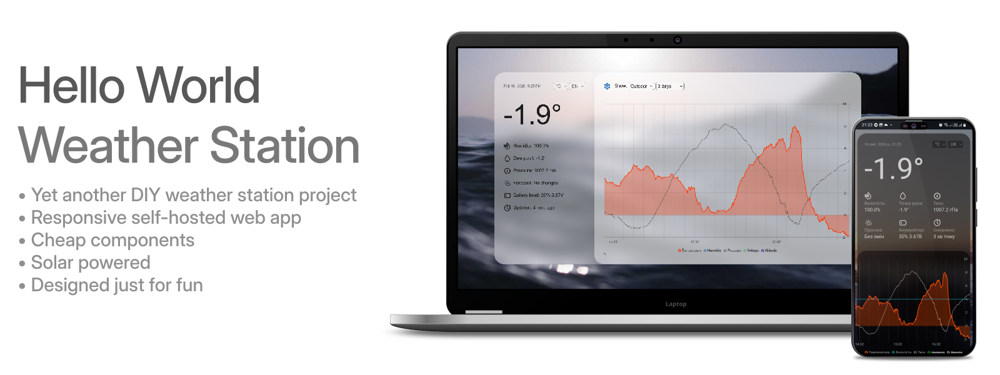
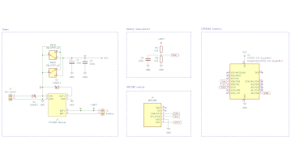
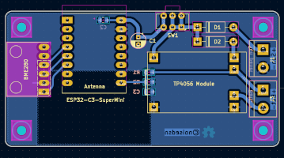
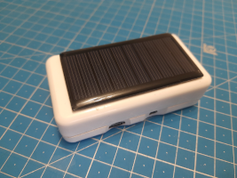
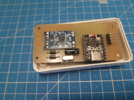
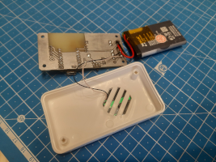
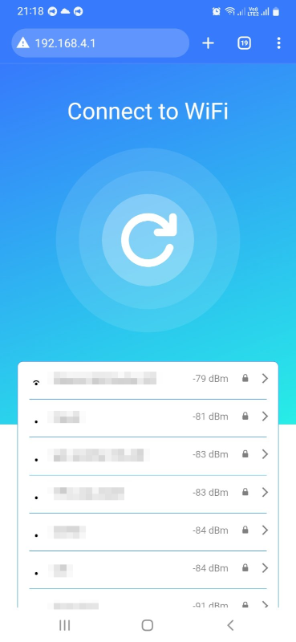

# HWWS

A humble weather station project created few years ago just because I wanted to play in some different fields, from hardware design and programming in few different languages to UI-UX and graphics design.

## Web server

Simple PHP backend that allows managing users, adding multiple sensors, making them public or private (available only for logged in users). Serverless SQLite database was chosen for simplicity. To prevent flooding, sensors are authorized with a simple Digest-like authentication and must be paired using the PIN code issued by the server.

Front-end features a responsive design and multilangual support.

### Requirements: 
- PHP 8+
- php-sqlite3

### Installation:
- Copy all files from the "webserver" directory to your server.
- Make sure that directories "/assets/favicon/cache" and "/db" are writable.
- Navigate to the selected URL and complete the setup process.

During the installation, the first created user will receive Administrator rights and will be able to add new users and sensors. Non-admin users can only view the configuration and access private sensors.

Next, add a sensor. Station elevation (in meters) is required to recalculate local atmospheric pressure to standard sea-level pressure.

## Hardware

### For a bare minimum:

- Microcontroller - ESP8266 or ESP32-C3.
- Temperature, humidity and pressure sensor - BME280.

### Optional (battery, solar charging, battery monitoring, improved stability): 

- TP4056 + DW01A charging module
- 6V Solar panel
- Single cell Li-ion or Lipo battery
- Few other discrete components, to complete power circuits. D1 and D1 must be a Zener diodes with a low forward voltage drop.

PCB designs are single-sided, made in KiCad and optimized for DIY etching at home (but can be manufactured as well). The photo shows my prototyping board, etched from a laser-printed page using citric acid + hydrogen peroxide recipe.

## Firmware

Sensor firmware is fully configurable via built-in web interface. Developed using Arduino IDE.

### Pairing process:
After first flashing, the microcontroller's WiFi access point will be active immediately, allowing you to pair the sensor with the web server. Connect, using the following credentials:

- AP SSID: `Weather Sensor`
- Password: `123456789`
- Open in browser: `192.168.4.1`

Next, finish the sensor setup:
- Enter SSID and password of your WiFi network.
- Server URL (homepage) where the HWWS webserver was installed.
- PIN code issued by the server. It is used to authenticate and identify sensors. 

If you need to change the settings later, press the reset button twice within a second and it will enter pairing mode again.